# Evidencias del laboratorio – BluePrints RT (Sockets & STOMP)

Backend usado: **P2 (Java21 + JWT)**, traído a `backend/` en este repo. Tecnología RT: **STOMP (Spring Boot)**.

**Video de la demo:** [Video.mp4](evidencias/Video.mp4) (56 s). La descripción está en la sección [Video de la demo](#video-de-la-demo).

## Índice de imágenes

| # | Descripción | Punto |
|---|---|---|
| 1 | `mvn compile` con BUILD SUCCESS sobre el backend ya copiado y con CORS agregado | [Backend: copia + CORS](#backend-copia-a-backend--cors) |
| 2 | Login en Swagger, token obtenido | [Backend: CRUD completo](#backend-crud-completo-put-y-delete) |
| 3 | Pegando el token en el botón Authorize | [Backend: CRUD completo](#backend-crud-completo-put-y-delete) |
| 4 | Sesión autorizada en Swagger | [Backend: CRUD completo](#backend-crud-completo-put-y-delete) |
| 5 | POST exitoso, blueprint `mari/pruebaLAB` creado (201) | [Backend: CRUD completo](#backend-crud-completo-put-y-delete) |
| 6 | PUT, reemplazo completo de puntos (200) | [Backend: CRUD completo](#backend-crud-completo-put-y-delete) |
| 7 | DELETE del blueprint de prueba (200) | [Backend: CRUD completo](#backend-crud-completo-put-y-delete) |
| 8 | Pantalla de login del Front | [Front: login y panel del autor](#front-login-y-panel-del-autor) |
| 9 | Tabla de planos del autor `juan` con el total de puntos | [Front: login y panel del autor](#front-login-y-panel-del-autor) |
| 10 | Plano `plano-1` cargado desde la API y STOMP conectado | [Front: login y panel del autor](#front-login-y-panel-del-autor) |
| 11 | Dos pestañas dibujando el mismo plano en vivo | [Tiempo real con STOMP](#tiempo-real-con-stomp) |
| 12 | Tercera pestaña en `plano-2` que no recibe los puntos de `plano-1` | [Tiempo real con STOMP](#tiempo-real-con-stomp) |
| 13 | Save/Update del plano dibujado, la tabla y el total se refrescan | [Front: CRUD desde la interfaz](#front-crud-desde-la-interfaz) |
| 14 | Create de `plano-3` | [Front: CRUD desde la interfaz](#front-crud-desde-la-interfaz) |
| 15 | `plano-3` dibujado y guardado | [Front: CRUD desde la interfaz](#front-crud-desde-la-interfaz) |
| 16 | Delete de `plano-3`, el total vuelve a su valor anterior | [Front: CRUD desde la interfaz](#front-crud-desde-la-interfaz) |
| 17 | Cliente en "reconectando..." con el backend apagado | [Análisis: latencia y reconexión](#análisis-latencia-y-reconexión) |
| 18 | Cliente reconectado solo, dibujando de nuevo | [Análisis: latencia y reconexión](#análisis-latencia-y-reconexión) |
| 19 | Save en la pestaña A y la pestaña B actualizada sola | [Sincronización del CRUD entre pestañas](#sincronización-del-crud-entre-pestañas) |
| 20 | Delete en la pestaña A cierra el plano también en la pestaña B | [Sincronización del CRUD entre pestañas](#sincronización-del-crud-entre-pestañas) |

---

## Backend: copia a `backend/` + CORS

Copiamos el código del backend de la Parte 2 (JWT) a la carpeta `backend/` de este repo, sin tocar el repositorio original de P2. Solo se trajeron `pom.xml` y `src/` (nada de `target/` ni de carpetas de build).

Luego agregamos **CORS** en `SecurityConfig.java`. Los navegadores, por seguridad, no dejan que una página cargada desde `http://localhost:5173` (el Front) le pida datos directamente a `http://localhost:8080` (el backend), porque son "orígenes" distintos, aunque ambos corran en la misma máquina local. Sin ninguna configuración adicional, el backend simplemente rechaza esas peticiones.

Para permitirlo, le dijimos explícitamente a Spring Security que sí confíe en peticiones que vengan de `http://localhost:5173`, y que acepte los métodos `GET`, `POST`, `PUT`, `DELETE` y `OPTIONS` (el último es el que el propio navegador manda solo, como "pregunta previa", antes de un `PUT` o `DELETE` real, para confirmar que tiene permiso; si el backend no responde que sí, el navegador ni siquiera intenta la petición real).

Compilamos con `mvn compile` parados dentro de `backend/` y quedó en verde.

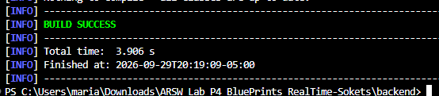
*Figura 1. `mvn compile` corriendo sobre el backend ya copiado a `backend/`, con CORS agregado. BUILD SUCCESS en 3.9s.*

---

## Backend: CRUD completo (PUT y DELETE)

El backend de P2 solo traía lectura, creación de un blueprint nuevo y una operación para agregar un punto suelto. Faltaban dos operaciones que exige el CRUD completo: reemplazar todos los puntos de un blueprint existente y eliminarlo.

Se agregaron los dos métodos en cada capa del backend: primero en la interfaz de persistencia (`BlueprintPersistence`), luego en su implementación contra Postgres (`PostgresBlueprintPersistence`), después en la capa de servicio (`BlueprintsServices`), y por último los dos endpoints nuevos en el controlador (`BlueprintsAPIController`).

Quedaron disponibles:
- `PUT /api/v1/blueprints/{author}/{bpname}`, reemplaza todos los puntos del blueprint con la lista que llega en el cuerpo de la petición.
- `DELETE /api/v1/blueprints/{author}/{bpname}`, elimina el blueprint.

Si el blueprint indicado no existe, ambas operaciones responden 404 automáticamente, usando el mismo manejador de errores que ya tenían los demás endpoints.

Esto se probó contra la base de datos real (Postgres en Docker), usando la interfaz de Swagger que ya traía el backend en lugar de `curl`.

Primero se hizo login y se autorizó la sesión con el token obtenido.

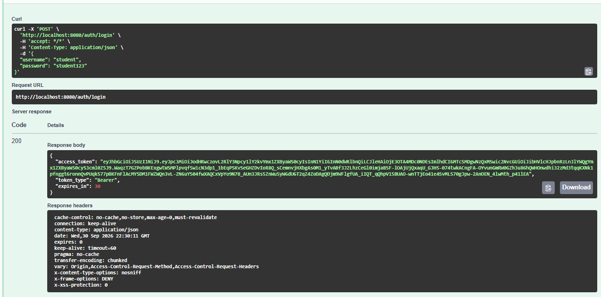
*Figura 2. Login desde Swagger, con el token de acceso en la respuesta.*

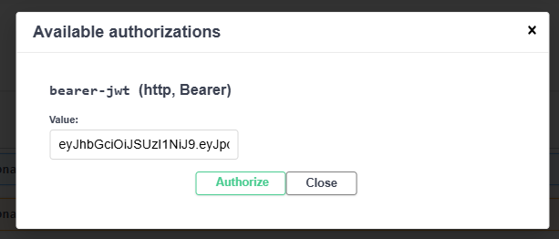
*Figura 3. El token pegado en el botón Authorize de Swagger.*

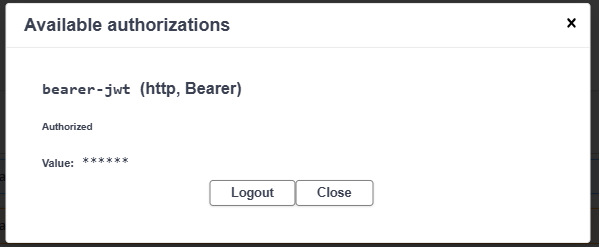
*Figura 4. La sesión queda autorizada para las siguientes peticiones.*

Con la sesión autorizada, el POST creó el blueprint `mari/pruebaLAB`.

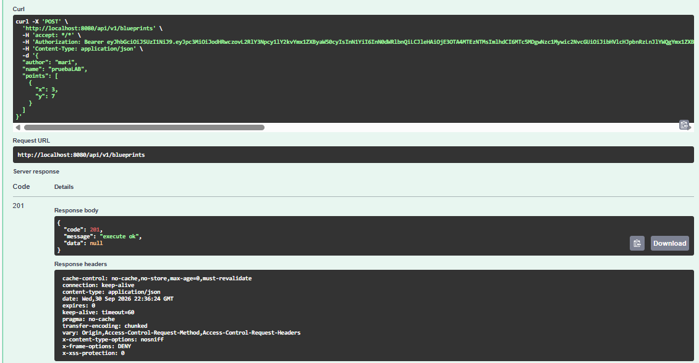
*Figura 5. Blueprint `mari/pruebaLAB` creado (201).*

Luego se probó el PUT nuevo (`/api/v1/blueprints/mari/pruebaLAB`), enviando un cuerpo `{"points": [...]}` que reemplazó toda la lista de puntos del blueprint.

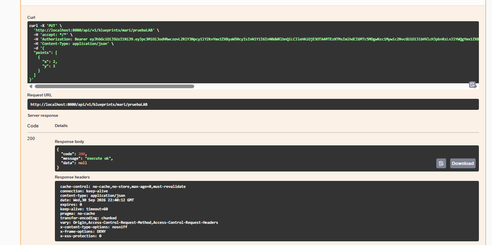
*Figura 6. El PUT respondiendo 200 y reemplazando los puntos del blueprint.*

Por último se borró el blueprint de prueba con el DELETE nuevo.

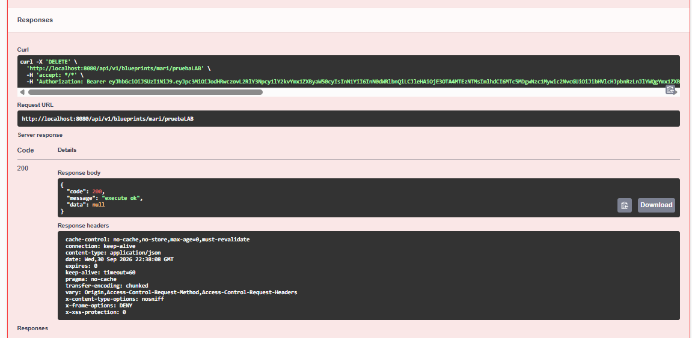
*Figura 7. Blueprint `mari/pruebaLAB` eliminado (200).*

Con esto quedaron probadas las cuatro operaciones del CRUD (crear, leer, actualizar y eliminar) contra la base de datos real.

---

## Antes de las pruebas del Front

El backend necesita un Postgres. Como en el repo no había forma de levantarlo, agregamos `backend/docker-compose.yml`, que crea la base `blueprints_db` con el mismo usuario y contraseña de `application.yml`. Con eso, levantar todo son tres comandos:

```bash
cd backend && docker compose up -d     # Postgres
mvn spring-boot:run                    # backend en :8080 (REST + STOMP)
cd .. && npm i && npm run dev          # Front en :5173
```

Para tener algo que mostrar se crearon por la API dos planos del autor `juan`: `plano-1` (una casita de 6 puntos) y `plano-2` (3 puntos).

Las capturas de esta parte se tomaron con un script de Playwright que abre el Front en Microsoft Edge, hace los clics como lo haría una persona y guarda la imagen de la pantalla en cada paso. Así cada imagen es la aplicación real funcionando contra el backend y la base de datos reales.

---

## Front: login y panel del autor

El `App.jsx` que venía con el enunciado era solo un esqueleto: pedía los puntos a una ruta que no existe en nuestro backend (`/api/blueprints/...` en vez de `/api/v1/blueprints/...`), no mandaba el token y no tenía tabla ni botones. Lo reescribimos usando los clientes que ya habíamos traído de la Parte 3 (`blueprintsApiClient.js` y `authClient.js`).

Como todos los endpoints de `/api/v1/**` piden JWT, lo primero que muestra la aplicación es un login. Al entrar, el token queda guardado en el navegador y `apiClient.js` lo agrega solo a cada petición. Si el token vence (el backend responde 401), la aplicación vuelve al login con un aviso.

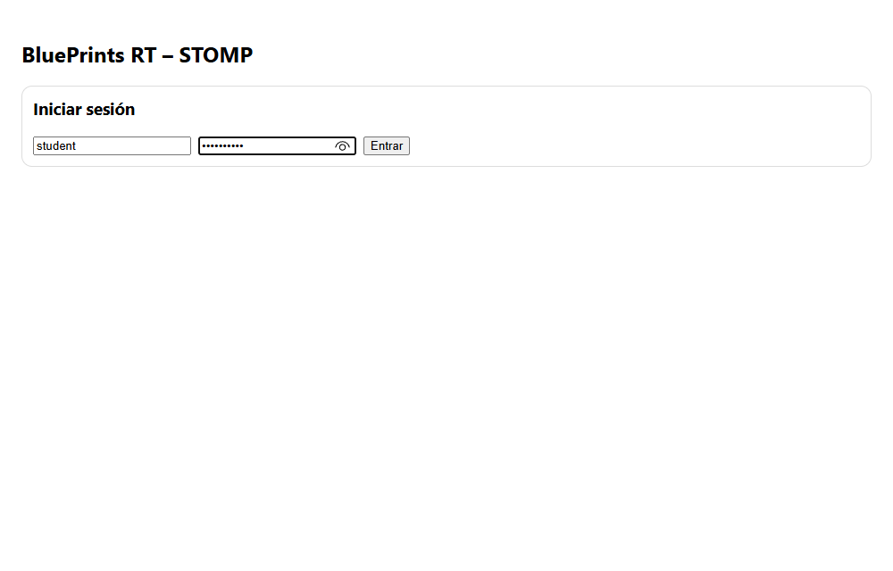
*Figura 8. Pantalla de login del Front (usuario `student`).*

Después del login se cargan los planos del autor. La tabla muestra cada plano con su cantidad de puntos, y la fila **Total** se calcula sumando los puntos de todos los planos con `reduce`:

```js
const totalPoints = blueprints.reduce((acc, bp) => acc + bp.points.length, 0)
```

Si el autor todavía no tiene planos, el backend responde 404; el Front lo interpreta como "lista vacía" y no como un error.

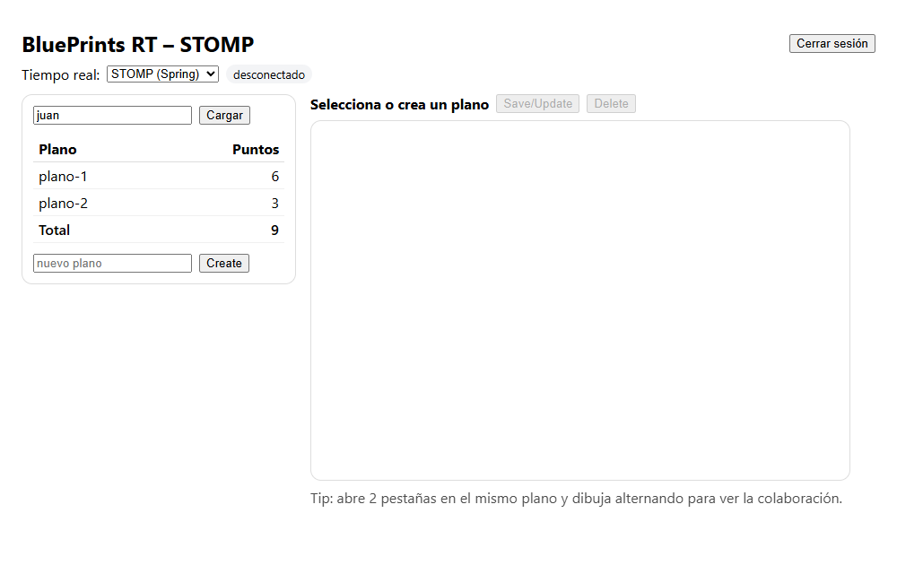
*Figura 9. Planos del autor `juan`: `plano-1` con 6 puntos, `plano-2` con 3, total 9.*

Al hacer clic en una fila, el Front pide ese plano a la API (`GET /api/v1/blueprints/juan/plano-1`) y lo dibuja en el canvas. Ese es el **estado inicial** del plano. La conexión STOMP ya está abierta desde el login (la etiqueta verde "conectado" lo confirma); al abrir el plano solo se suscribe a su tópico.

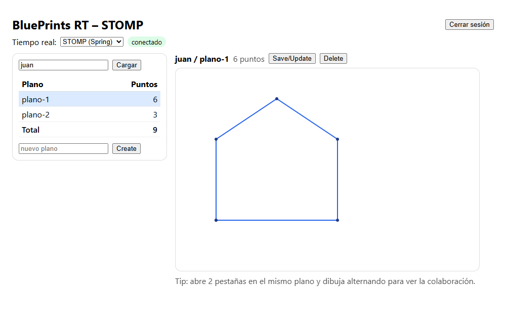
*Figura 10. `plano-1` cargado desde la API y dibujado en el canvas, con STOMP conectado.*

---

## Tiempo real con STOMP

Cada plano tiene su propio "canal" en el backend, llamado tópico: `/topic/blueprints.{autor}.{plano}`. Cuando alguien hace clic en el canvas, el Front no pinta el punto directamente: lo envía al backend a `/app/draw`, y el `DrawController` lo reenvía a todos los que estén suscritos al tópico de ese plano, **incluida la misma pestaña que lo mandó**. Así todas las pestañas pintan los puntos en el mismo orden y nadie queda desfasado.

Al probarlo encontramos dos problemas en el cliente STOMP del esqueleto, y los corregimos:

1. El backend manda **un punto por mensaje** (`{ author, name, point }`), pero el Front esperaba la lista completa de puntos (`upd.points`) y se rompía al recibir el primer mensaje. Ahora agrega el punto recibido a los que ya tenía.
2. La dirección del WebSocket se armaba con `http://`. Ahora se convierte a `ws://`, que es lo que espera un WebSocket.

Para la prueba se abrieron dos pestañas en `juan/plano-1`. Desde la pestaña A se dibujó una puerta (4 clics) y desde la pestaña B una ventana (4 clics). Las dos terminaron con los mismos 14 puntos, en el mismo orden.

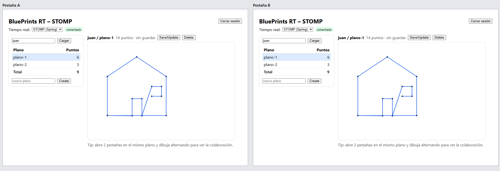
*Figura 11. Pestañas A y B en `juan/plano-1`. La puerta se dibujó desde A y la ventana desde B; las dos ven el plano completo (14 puntos).*

Al mismo tiempo había una tercera pestaña abierta en `juan/plano-2`. Como está suscrita a otro tópico, no recibió ninguno de esos 8 puntos: cada plano está **aislado** de los demás.

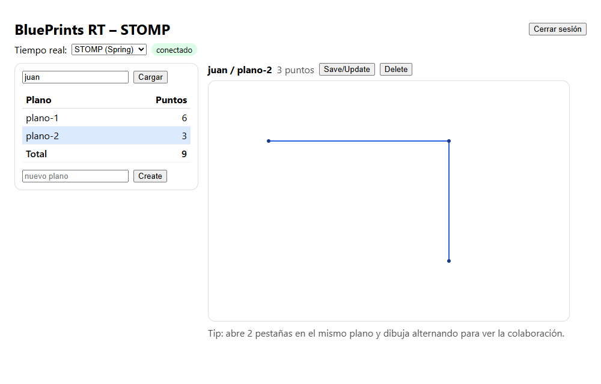
*Figura 12. La pestaña en `plano-2` sigue con sus 3 puntos mientras se dibujaba en `plano-1`.*

Además, en la consola del navegador quedan registros de la conexión, la suscripción y cada punto recibido. Esto es lo que mostró la pestaña B durante la prueba:

```
[STOMP] conectado a http://localhost:8080
[STOMP] suscrito a /topic/authors.juan
[STOMP] suscrito a /topic/blueprints.juan.plano-1
[STOMP] punto recibido {x: 181, y: 301}
[STOMP] punto recibido {x: 181, y: 231}
[STOMP] punto recibido {x: 221, y: 231}
[STOMP] punto recibido {x: 221, y: 301}
[STOMP] punto recibido {x: 261, y: 181}
[STOMP] punto recibido {x: 301, y: 181}
[STOMP] punto recibido {x: 301, y: 221}
[STOMP] punto recibido {x: 261, y: 221}
```

Y la pestaña de `plano-2`, en el mismo tiempo, solo registró su propia suscripción:

```
[STOMP] conectado a http://localhost:8080
[STOMP] suscrito a /topic/authors.juan
[STOMP] suscrito a /topic/blueprints.juan.plano-2
```

(La suscripción a `/topic/authors.juan` se explica en [Sincronización del CRUD entre pestañas](#sincronización-del-crud-entre-pestañas).)

---

## Front: CRUD desde la interfaz

Los puntos que llegan por STOMP solo viajan entre pestañas; **no se guardan en la base de datos** hasta que alguien presiona **Save/Update**. Por eso, mientras haya puntos nuevos sin guardar, junto al nombre del plano aparece "sin guardar".

**Save/Update.** Llama al `PUT` que agregamos al backend (`PUT /api/v1/blueprints/juan/plano-1`) con todos los puntos del canvas y luego vuelve a pedir la lista del autor. En la tabla, `plano-1` pasó de 6 a 14 puntos y el total de 9 a 17.

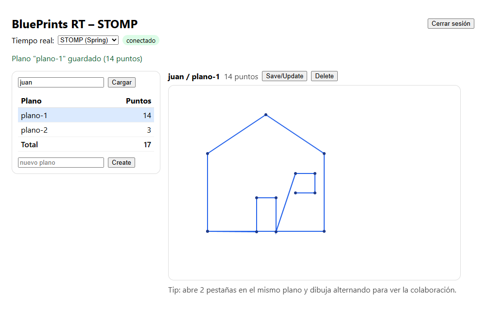
*Figura 13. `plano-1` guardado con 14 puntos; la tabla y el total (17) se refrescan.*

**Create.** Se escribe el nombre en "nuevo plano" y se presiona **Create**. El Front hace `POST /api/v1/blueprints` con el plano vacío, lo agrega a la tabla y lo abre en el canvas ya conectado a su tópico.

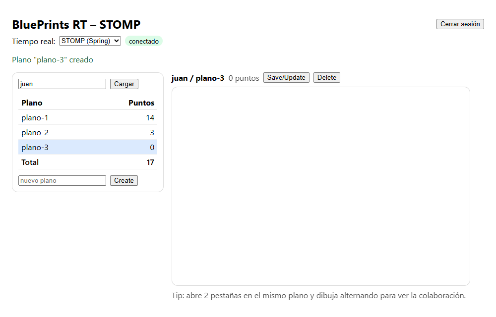
*Figura 14. `plano-3` creado vacío y abierto en el canvas.*

Se dibujó un triángulo y se guardó. El total subió de 17 a 21. Después se recargó la página y, al abrir `plano-3`, seguía teniendo sus 4 puntos, lo que confirma que quedaron guardados en Postgres.

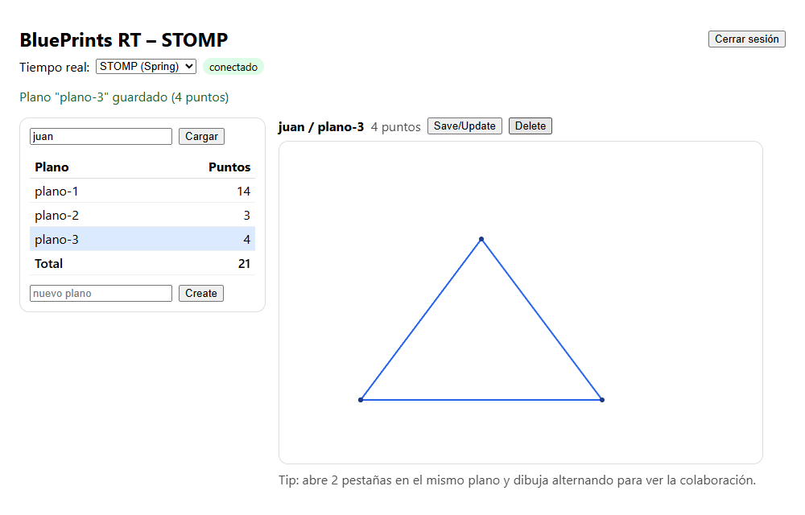
*Figura 15. `plano-3` con 4 puntos guardados; total 21.*

**Delete.** El botón pide confirmación y luego llama a `DELETE /api/v1/blueprints/juan/plano-3`. El plano desaparece de la tabla, el canvas se limpia y el total vuelve a 17.

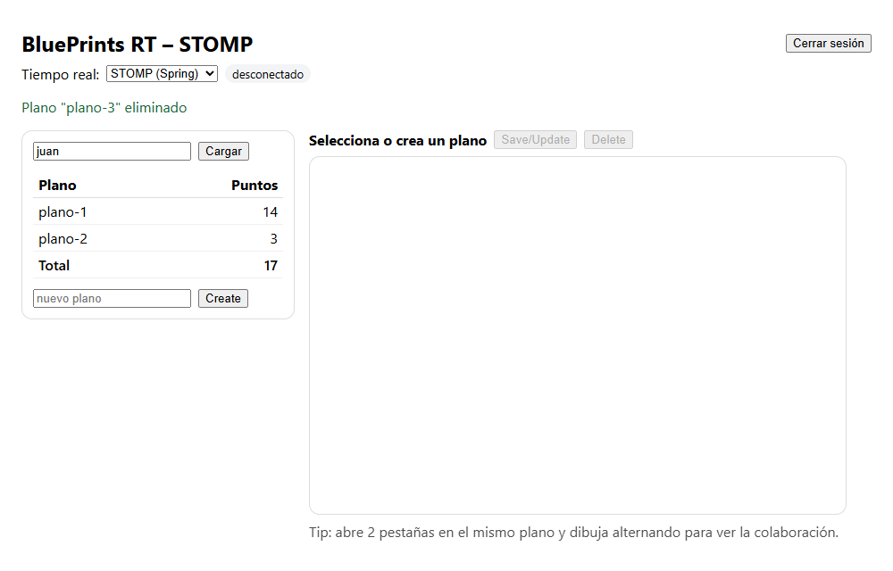
*Figura 16. `plano-3` eliminado; la tabla y el total vuelven a como estaban.*

Si una operación falla (por ejemplo, crear un plano que ya existe), el mensaje que devuelve el backend aparece en rojo arriba del panel, en vez de fallar en silencio.

---

## Análisis: latencia y reconexión

**Latencia.** Durante la prueba de las dos pestañas medimos cuánto tarda un punto desde el clic en una pestaña hasta que aparece en la otra. En las 8 mediciones (4 en cada dirección) estuvo entre **33 y 53 ms**, y ese tiempo incluye el clic simulado y el redibujo del canvas. Todo corre en la misma máquina, así que en una red real habría que sumar el tiempo de viaje por la red, pero para dibujar a mano la sensación es inmediata.

Una curiosidad que encontramos al medir: si la pestaña que dibuja está en segundo plano, el navegador la "frena" para ahorrar recursos, y en esas condiciones las mediciones llegaron a 2–3 segundos. No es un problema del backend ni de STOMP; para el video conviene tener las dos ventanas visibles lado a lado.

**Reconexión.** Con una pestaña abierta en `plano-2` apagamos el backend a propósito. La etiqueta pasó a "reconectando..." y el cliente siguió intentando conectarse cada segundo (`reconnectDelay: 1000` en `stompClient.js`).

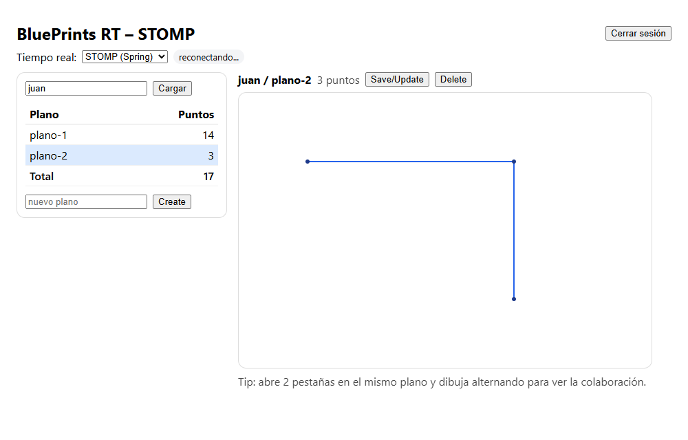
*Figura 17. Backend apagado: el cliente muestra "reconectando..." y la página sigue funcionando.*

Al volver a levantar el backend (tarda unos 17–19 segundos en arrancar), el cliente se reconectó **en menos de un segundo** (0,8 s en una prueba y 0,09 s en otra; depende de en qué momento del reintento de cada segundo vuelve el backend). Se volvió a suscribir solo a los tópicos de `plano-2` y del autor, y el siguiente punto dibujado llegó normalmente, sin recargar la página.

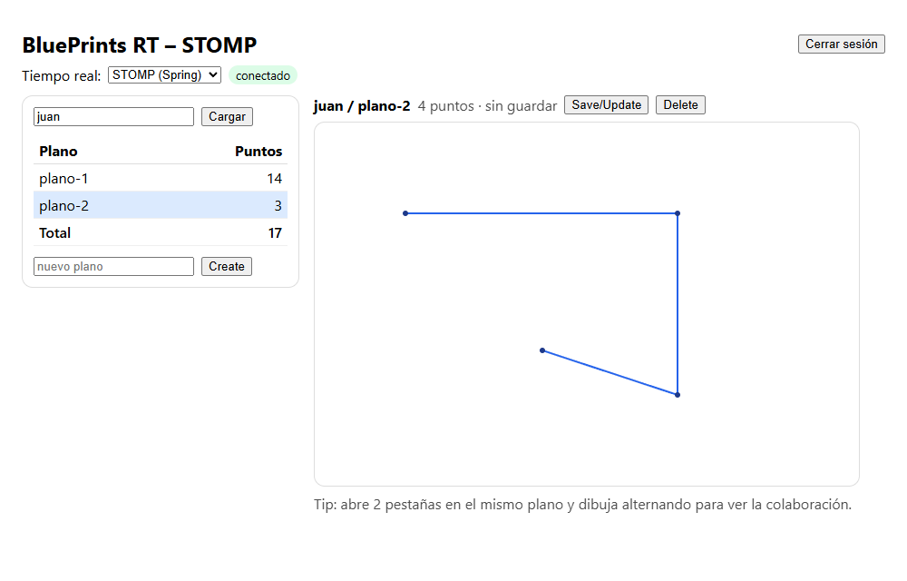
*Figura 18. Backend de nuevo arriba: el cliente se reconectó solo y el punto nuevo llegó por el tópico.*

Lo que **no** se recupera son los puntos que alguien dibuje mientras el backend está caído: esa pestaña los pinta localmente, pero las otras no los reciben. Si después se presiona Save, sí quedan en la base de datos, y las demás pestañas los ven al volver a abrir el plano.

**Pros y contras de STOMP frente a Socket.IO** (en este laboratorio solo implementamos STOMP):

| | STOMP (Spring) | Socket.IO (Node) |
|---|---|---|
| Integración con nuestro backend | Corre dentro del mismo backend de Spring, en el mismo puerto, sin un servidor aparte | Habría que montar y mantener un servidor Node adicional |
| Canales | Tópicos `/topic/...` con prefijos estándar; el broker en memoria de Spring hace el reenvío | Salas (`join-room`) que se manejan a mano en el servidor |
| Reconexión | La da `@stomp/stompjs` (`reconnectDelay`); hay que volver a suscribirse en `onConnect` | Viene incluida y vuelve a unirse a la sala si se programa en el evento `connect` |
| Contras | Más configuración (prefijos, broker, endpoint); el broker en memoria no sirve si hay varias instancias del backend | Es otro proceso y otro lenguaje que desplegar, y no comparte la seguridad JWT de Spring |

---

## Sincronización del CRUD entre pestañas

Al grabar la demo encontramos un problema: al presionar **Save/Update** en una pestaña, la otra no cambiaba nada. Seguía mostrando "sin guardar" y la tabla con los conteos viejos, aunque los puntos sí le habían llegado por STOMP. Con Create y Delete pasaba lo mismo: solo se enteraba la pestaña que hacía la operación, porque era la única que volvía a pedir la lista a la API.

Para resolverlo, ahora **el backend avisa por STOMP cada vez que un plano cambia**. Después de cada `POST`, `PUT` o `DELETE` exitoso, `BlueprintsAPIController` publica un mensaje corto en el tópico del autor:

```
/topic/authors.{autor}   →   { "action": "created" | "updated" | "deleted", "author": "juan", "name": "plano-1" }
```

Cada pestaña se suscribe al tópico del autor que tiene cargado en la tabla. Al recibir un aviso, vuelve a pedir la lista (así la tabla y el total quedan al día). Si el aviso es sobre el plano que tiene abierto, también hace algo con el canvas:
- **updated:** vuelve a leer el plano desde la API y quita el "sin guardar".
- **deleted:** cierra el plano y avisa que fue eliminado.

Decidimos que el aviso lo mande el backend, y no la pestaña que guardó, para que solo se anuncie lo que de verdad quedó guardado en la base de datos. Si el `PUT` falla, nadie recibe un aviso falso.

También reorganizamos la conexión del Front: antes se abría una conexión STOMP por cada plano abierto; ahora hay **una sola conexión** mientras la sesión esté iniciada, y sobre ella dos suscripciones, una al tópico del plano (puntos) y otra al tópico del autor (cambios del CRUD).

Prueba: con las dos pestañas en `juan/plano-1`, se dibujó en ambas y se presionó Save en la pestaña A. La pestaña B, sin tocarla, quitó el "sin guardar" y actualizó la tabla (`plano-1` con 14 puntos, total 17).

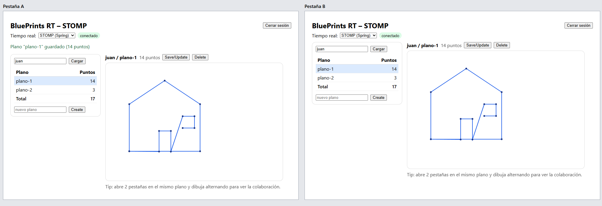
*Figura 19. Save en la pestaña A; la pestaña B se actualiza sola: 14 puntos guardados, total 17.*

Luego, con `plano-3` abierto en las dos pestañas, se borró desde A. La pestaña B cerró el plano, mostró el aviso y su total volvió a 17. Al crear `plano-3` desde A también había aparecido en la tabla de B sin recargar.

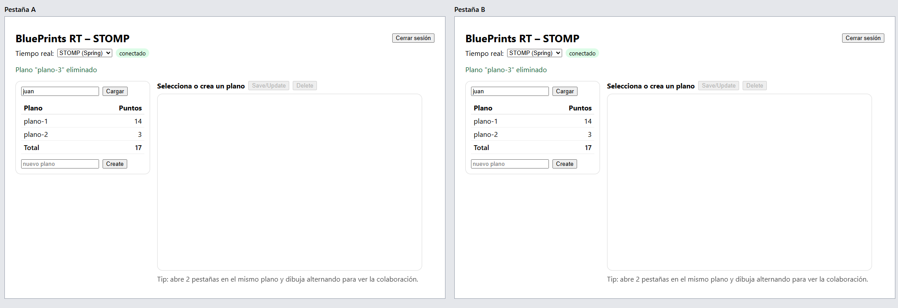
*Figura 20. Delete en la pestaña A; la pestaña B, que tenía el mismo plano abierto, lo cierra y actualiza la tabla.*

Así se ve en la consola de la pestaña B:

```
[STOMP] cambio en plano {action: updated, author: juan, name: plano-1}
[STOMP] cambio en plano {action: created, author: juan, name: plano-3}
[STOMP] cambio en plano {action: updated, author: juan, name: plano-3}
[STOMP] desuscrito de /topic/blueprints.juan.plano-1
[STOMP] suscrito a /topic/blueprints.juan.plano-3
[STOMP] cambio en plano {action: deleted, author: juan, name: plano-3}
[STOMP] desuscrito de /topic/blueprints.juan.plano-3
```

---

## Video de la demo

[Video.mp4](evidencias/Video.mp4) dura 56 segundos y muestra dos ventanas del navegador lado a lado, con la sesión ya iniciada (el login está en la Figura 8). Las dos tienen cargado al autor `juan`.

| Tiempo | Qué se ve |
|---|---|
| 0:00 – 0:20 | Las dos ventanas en `plano-1`, la casita con puerta y una ventana (14 puntos). Se dibuja una segunda ventana en la casita y los puntos aparecen en las dos ventanas al mismo tiempo (14 a 20 puntos, "sin guardar"). Luego **Save/Update**: `plano-1` queda con 20 puntos y el total en 23. |
| 0:20 – 0:34 | **Create** de `plano-3` en la ventana A. Aparece también en la tabla de la ventana B sin recargar. A empieza a dibujar en `plano-3` mientras B abre `plano-2`. |
| 0:34 – 0:45 | Cada ventana en un plano distinto: lo que se dibuja en uno no aparece en el otro (aislamiento por plano). B dibuja en `plano-2`. |
| 0:45 – 0:56 | **Save** de `plano-2` en B: la tabla de A se actualiza sola (`plano-2` con 6 puntos, total 26). Por último, **Delete** de `plano-3` en A, que también desaparece de la tabla de B. |

---
